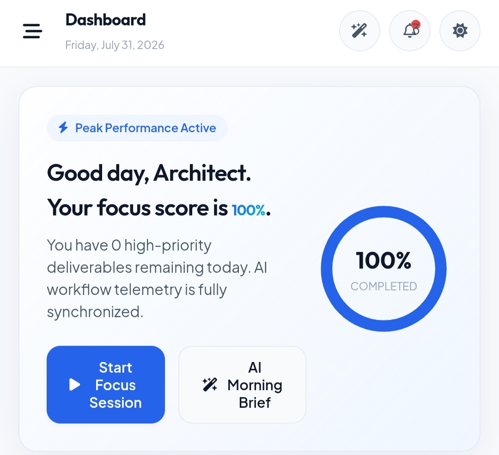

<div align="center">

# 🚀 LifeFlow AI

### AI Productivity & Life Planner

Build Better Habits • Achieve Goals • Stay Productive • Organize Your Life

<p align="center">
  <a href="https://life-flow-ai-app.vercel.app">
    
  </a>
  <a href="https://github.com/KRIXORA/LifeFlow-AI">
    
  </a>
  <a href="https://github.com/KRIXORA/LifeFlow-AI/network/members">
    
  </a>
  
</p>

<p align="center">
  
  
  
  
  
</p>

</div>

---

# 🌟 About

**LifeFlow AI** is a modern productivity and life management platform that helps users organize daily activities, manage goals, build habits, plan schedules, monitor progress, and improve productivity through a clean, responsive, and intelligent interface.

Whether you're a student, freelancer, developer, or professional, LifeFlow AI provides everything you need to build a better daily workflow.

---

# ✨ Features

| Productivity | Planning | Intelligence |
|--------------|----------|--------------|
| ✅ Dashboard | 📅 Calendar | 🧠 AI Hub |
| 🎯 Goal Tracker | 📝 Daily Planner | 📊 Analytics |
| 🔥 Habit Tracker | ⏱ Pomodoro Timer | 💡 Insights |
| 📈 Progress Tracking | ⚙ Settings | 🌙 Dark Mode |

---

# 🖼️ Preview



---

# 🚀 Live Demo

### 🌐 Website

https://life-flow-ai-app.vercel.app

---

# ⚙️ Tech Stack

| Technology | Usage |
|------------|-------|
| HTML5 | Structure |
| CSS3 | Styling |
| JavaScript (ES6) | Application Logic |
| Local Storage | Data Persistence |
| Service Worker | Offline Support |
| Manifest | Installable PWA |

---

# 📂 Project Structure

```text
LifeFlow-AI/

├── assets/
│
├── css/
│
├── js/
│
├── images/
│
├── icons/
│
├── index.html
├── manifest.json
├── sw.js
└── README.md
```

---

# 🚀 Getting Started

## Clone Repository

```bash
git clone https://github.com/KRIXORA/LifeFlow-AI.git
```

## Open Project

```bash
cd LifeFlow-AI
```

Run with Live Server or simply open:

```text
index.html
```

---

# 📱 Progressive Web App

LifeFlow AI works like a native application.

✅ Installable

✅ Offline Support

✅ Fast Loading

✅ Responsive

---

# 🎯 Current Modules

- Dashboard
- Planner
- Calendar
- Goals
- Habit Tracker
- Pomodoro
- Analytics
- Settings
- AI Hub

---

# 🔮 Future Roadmap

- ☁ Cloud Synchronization
- 🔐 Authentication
- 👥 Team Workspace
- 📱 Android App
- 🍎 iOS App
- 📊 AI-generated Analytics Reports
- 📅 Google Calendar Sync
- 🧩 Plugin System
- 🌍 Multi-language Support

---

# 🤝 Contributing

Contributions are always welcome.

```bash
Fork Repository

↓

Create Feature Branch

↓

Commit Changes

↓

Push Branch

↓

Open Pull Request
```

---

# 📊 Project Status

| Status | Progress |
|---------|----------|
| UI Design | ██████████ 100% |
| Core Features | █████████░ 90% |
| AI Features | ████████░░ 80% |
| PWA | ██████████ 100% |
| Optimization | ████████░░ 80% |

---

# 👨‍💻 Developer

## KRIXORA

Creative Frontend Developer

Building Modern AI & Productivity Experiences

### GitHub

https://github.com/KRIXORA

---

# ❤️ Support

If you enjoyed this project...

⭐ Star this repository

🍴 Fork it

📢 Share it

Every star motivates future development.

---

# 📜 License

Licensed under the MIT License.

---

<div align="center">

## 🚀 Built with Passion by KRIXORA

*"Design your workflow. Build your future."*

</div>
